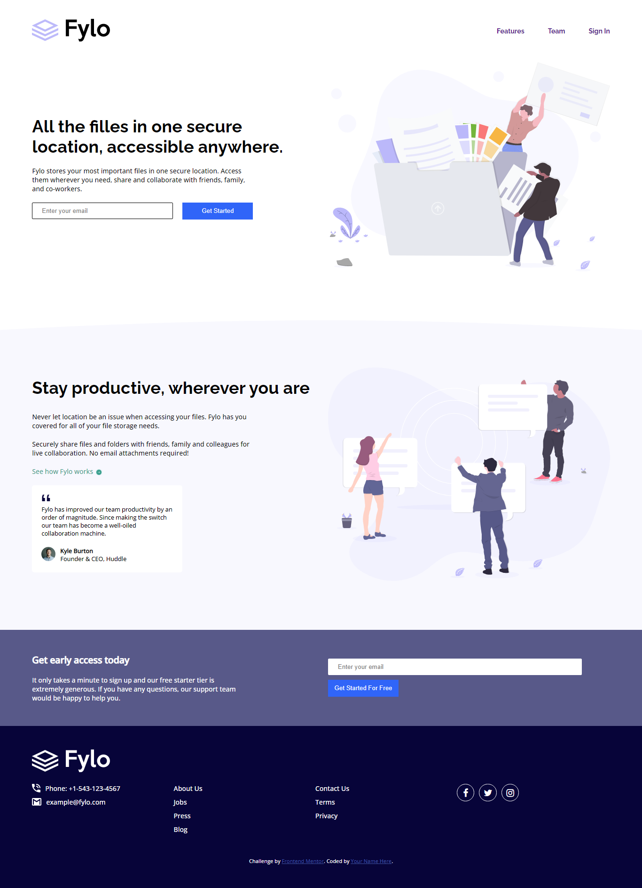

# Frontend Mentor - Fylo landing page with two column layout solution

This is a solution to the [Fylo landing page with two column layout challenge on Frontend Mentor](https://www.frontendmentor.io/challenges/fylo-landing-page-with-two-column-layout-5ca5ef041e82137ec91a50f5). Frontend Mentor challenges help you improve your coding skills by building realistic projects. 

## Table of contents

- [Overview](#overview)
  - [The challenge](#the-challenge)
  - [Screenshot](#screenshot)
  - [Links](#links)
- [My process](#my-process)
  - [Built with](#built-with)
  - [What I learned](#what-i-learned)
  - [Continued development](#continued-development)
  - [Useful resources](#useful-resources)
- [Author](#author)
- [Acknowledgments](#acknowledgments)


## Overview
The project is about Fylo landing page with two column layout and it is responsive across all screen size, it has email verification to check if the submitted input is a valid email, also has hover states to make the page interactive
### The challenge

Users should be able to:

- View the optimal layout for the site depending on their device's screen size
- See hover states for all interactive elements on the page

### Screenshot




### Links

- Solution URL: [Add solution URL here](https://github.com/TRIPLE-ADE/Fylo-landing-page)
- Live Site URL: [Add live site URL here](https://triple-ade.github.io/Fylo-landing-page/)

## My process

### Built with

- Semantic HTML5 markup
- CSS custom properties
- Flexbox
- CSS Grid
- Mobile-first workflow


**Note: These are just examples. Delete this note and replace the list above with your own choices**

### What I learned

Use this section to recap over some of your major learnings while working through this project. Writing these out and providing code samples of areas you want to highlight is a great way to reinforce your own knowledge.

To see how you can add code snippets, see below:

```html
<h1>Some HTML code I'm proud of</h1>
```
```css
*{
    box-sizing: border-box;
    margin: 0;
    padding: 0;
}
:root{
    --Very-Dark-Blue: hsl(243, 87%, 12%);
    --Desaturated-Blue: hsl(238, 22%, 44%);
    --Bright-Blue: hsl(224, 93%, 58%);
    --Moderate-Cyan: hsl(170, 45%, 43%);
    --Light-Grayish-Blue: hsl(240, 75%, 98%);
    --Light-Gray: hsl(0, 0%, 75%);
}
```
```js
document.querySelectorAll(".submit").forEach(e => {
    e.addEventListener('click', function (event) {
      //email verification
        let validEmail =  /^[a-zA-Z0-9.!#$%&'*+/=?^_`{|}~-]+@[a-zA-Z0-9-]+(?:\.[a-zA-Z0-9-]+)*$/
        error.style.display = 'block'
        errorContact.style.display = 'block'

        if(!(email.value.match(validEmail))){
            error.innerText = "Please check your email"
            email.style.borderColor = "red"
        }
        
        if(!(emailContact.value.match(validEmail))){
            errorContact.innerText = "Please check your email"
            emailContact.style.borderColor = "red"
        }

        //setting timeout to 2 seconds
        setTimeout(() => {
            error.style.display = 'none'
            errorContact.style.display = 'none'
            email.style.borderColor = "#000"
            emailContact.style.borderColor = "#000"
        }, 2000);

        //setting default email value to  an empty string
        email.value = ""
        emailContact.value = ""
    })
})
```

If you want more help with writing markdown, we'd recommend checking out [The Markdown Guide](https://www.markdownguide.org/) to learn more.


### Continued development

Use this section to outline areas that you want to continue focusing on in future projects. These could be concepts you're still not completely comfortable with or techniques you found useful that you want to refine and perfect.
- css variable
- javaScript DOM

## Author
- Website - [TripleA](https://triple-ade.github.io/Fylo-landing-page/)
- Frontend Mentor - [@TRIPLE-ADE](https://www.frontendmentor.io/profile/TRIPLE-ADE)
- Twitter - [@Triple123A](https://www.twitter.com/Triple123A)